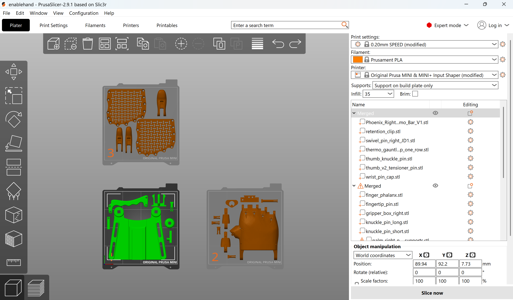
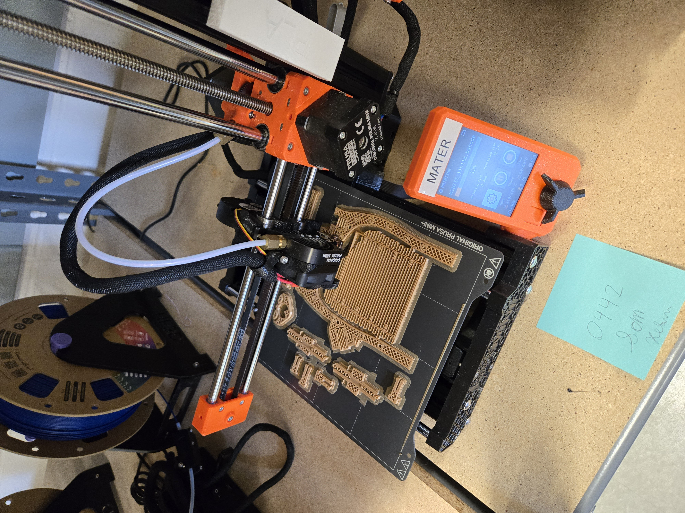
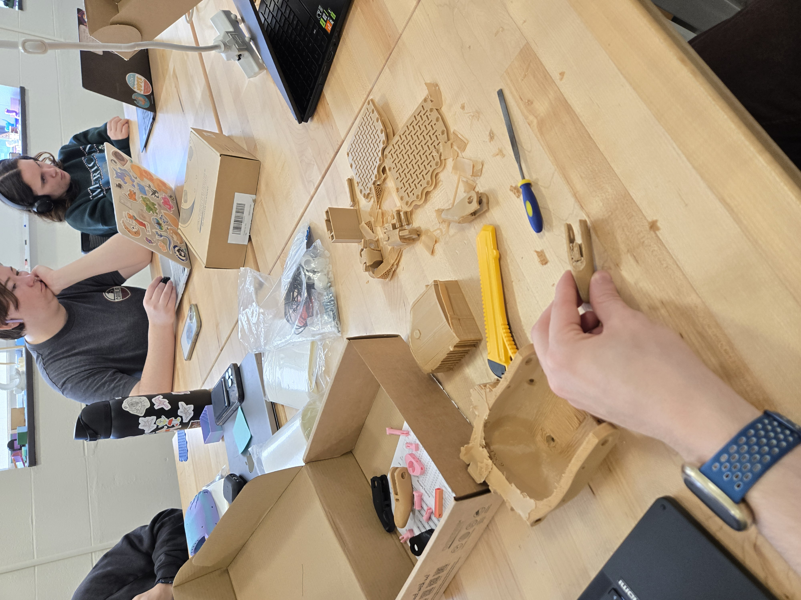
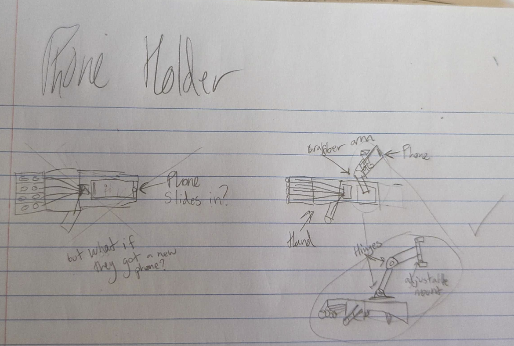
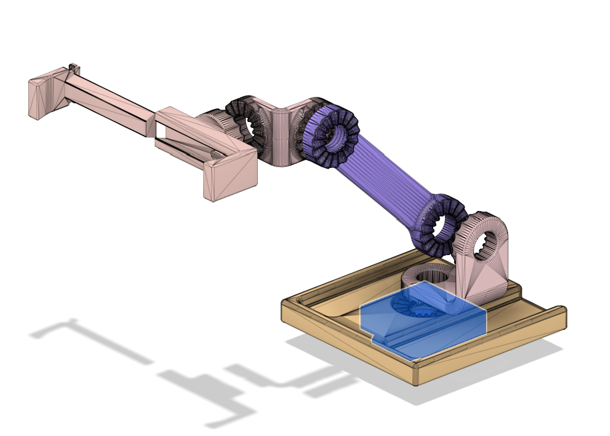
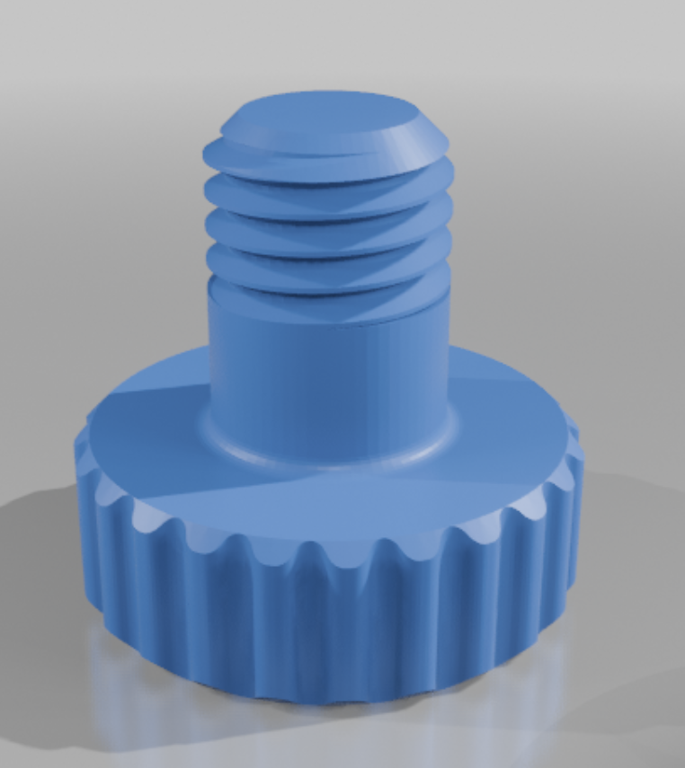

## Introduction 

In this project, I explored the world of open-source accessibility hardware by 3D printing and assembling an e-NABLE Phoenix v2 prosthetic hand at 150% scale. Using resources from the e-NABLE hub, I navigated open-source documentation, critiqued its clarity, and proposed improvements. The hands-on experience with Prusa 3D printers and assembly kits deepened my understanding of rapid prototyping for assistive devices. As part of my reflection, I conceptualized a design modification by adding a phone holder arm to enhance usability for individuals with limited hand function. This project reinforced my appreciation for open-source collaboration in engineering for accessibility.

## Comparing Documentation

### [e-NABLE Hub](https://hub.e-nable.org/p/devices?p=Phoenix+v2+Hand) vs. [NIH](https://3d.nih.gov/entries/3DPX-020259)

For this project, we were given two different websites to gather information from. Both websites were overall very similar and contained about the same information. However, I found the layout of the e-NABLE Hub website more user-friendly, as it immediately provided a description of the hand followed by the files and resources needed to build it. Additionally, the e-NABLE Hub website includes links to video tutorials, which were helpful. While the NIH 3D Print Exchange offers more download format options and does include the same documentation, it is less structured and harder to navigate. Users may need to search more to find the necessary instructions. To improve usability, the NIH platform could better organize its resources and integrate step-by-step guides like e-NABLE. Overall, e-NABLE offers a more accessible, simpler, and structured experience for building the hand.

### Video vs. PDF

The e-NABLE Hub website provides both video instructions and a PDF guide for assembling the prosthetic hand. In general, I find that video instructions tend to be easier to follow than written guides, and this case was no exception. The video not only offers a clearer, step-by-step demonstration but also includes additional details not covered in the PDF. For instance, the video provides instructions for the thermo-fitting of the wrist, a crucial step that is missing from the PDF guide. However, I noticed that the video’s thermo-fitting procedure differed from the method we used during assembly. Instead of using hot water, we used a heat gun and a 3D-printed mold, which seemed much more effective. While this method requires a heat gun, something not everyone has access to, I think it would be valuable for the video or PDF to at least mention it as an alternative.

Additionally, the PDF documentation lacks a comprehensive list of all required parts at the beginning, which would be a simple yet valuable addition for better clarity.

One of the most challenging steps, stringing the fingers, was much easier to understand through the video. While the text description in the PDF was fairly clear, I believe the process could be improved by incorporating a hole-by-hole visual guide. A labeled diagram showing the exact order in which the string should pass through each hole would make this step significantly easier to follow.

## Printing

Before assembling the prosthetic hand, we first had to prepare the 3D models for printing. The downloaded files included parts for both left and right hands, but it was somewhat difficult to determine which pieces were necessary for each. As mentioned earlier, a clearly labeled parts list for a single hand at the beginning of the instruction document would have been helpful.

After importing the required files into Prusa Slicer and scaling them up by 150%, we proceeded with the following setup:

A minimum of three print beds were needed, making the printing process time-consuming. As shown in the image above, we applied build plate supports and used 35% infill. Additionally, we added three raft layers, which required merging all objects on each print bed to ensure a uniform raft and prevent collisions.

In hindsight, most of the objects likely didn’t require a raft layer, and its inclusion made post-processing more difficult. Removing the excess PLA layers became a tedious part of the cleanup process.

## Assembling

Assembly was straightforward, though we primarily followed the written documentation despite its shortcomings (without any particular reason—we just did).  

  

The most challenging part was stringing the fingers. At one point, we tied knots too early and had to painstakingly untie them using tweezers. In hindsight, following the video tutorial would have been a better approach, along with reading further ahead in the instruction manual before attempting to string the fingers. Overall, however, the assembly process was fairly simple.  

Another issue we encountered was installing the swivel pin. We weren’t entirely sure which screws to use, leading to some trial and error. Screwing into the PLA was also tricky, as the threads inside were not well-formed, making the process more difficult. After using the assembled hand for a short time, the screws attaching the swivel pin tore out, destroying the threads in the process. This required us to reprint the swivel pin.

## Finished Build

## Adding a Multifunctional Arm Phone Holder

As part of learning to utilize and modify open-source accessibility hardware, we decided to add a multifunctional arm-mounted phone holder to the back of the wrist. The goal was to make it easier for someone missing a hand to use a cellphone and perform other tasks by mounting the phone to their other wrist. We sourced the design for the arm holder from [Thingiverse](https://www.thingiverse.com/thing:6917657).  

The idea was to securely attach the arm to the back of the gripper box using adhesive, providing a stable mounting point for the phone.  

Here is our initial sketch of the design:  

  

And here is a mock-up in Fusion 360:  

  

The actual phone holder requires a rubber band to keep the phone stable but otherwise does not need any additional parts. The gear-like connectors allow the position to be locked in place with the addition of these screws:  

  

## Ethical Reflection on Open-Source Prosthetic Design  

This project highlighted the impact of open-source accessibility hardware and the ethical considerations that come with designing assistive technology. The e-NABLE organization embodies the principles of community-driven innovation, where volunteers use rapid prototyping to create affordable prosthetics for those in need. However, while open-source designs offer accessibility and affordability, they also present challenges in usability, customization, and documentation quality.  

One key ethical question is whether these prosthetics truly meet the needs of their users. As discussed in Microsoft's [Inclusive Design Toolkit](https://inclusive.microsoft.design/), effective assistive technology must be designed with, not just for, the people who use it. While e-NABLE has made great strides in normalizing prosthetic access, the process would benefit from more direct user feedback loops. Many users may have unique needs that a one-size-fits-all design cannot fully address. A start might be to provide the full CAD files used to make the design instead of just the mesh files. Additionally, future versions should implement feedback presented by users, for instance a comment on the e-NABLE site highlights that wrist pins were a common and frequent failure mode.

Another consideration is the role of rapid prototyping in prosthesis development. 3D printing allows for low-cost, iterative improvements, but it also introduces concerns about durability and long-term wearability. The prosthetic hand we built, for instance, had limitations in structural integrity, as demonstrated when the screws attaching the swivel pin tore out. This raises an important point—just because a technology is accessible and inexpensive doesn’t automatically make it the best solution. Inclusive design requires balancing affordability with functionality, ensuring that devices are both practical and reliable.  

Additionally, the documentation provided for assembling the prosthetic revealed gaps in accessibility. Microsoft's Inclusive Design principles emphasize the importance of clear, multimodal communication. In this case, while a video guide was available, the written instructions lacked clarity in certain areas, such as part identification and assembly steps. Improving documentation to be more universally accessible perhaps by, including better diagrams, clearer labeling, and multiple instructional formats, would enhance usability for a broader audience.  

Ultimately, this project reinforced the idea that ethical design is about more than just making something work—it’s about making it work well for the people who need it most. Open-source initiatives like e-NABLE have the potential to transform lives, but they should continuously strive to integrate user feedback, improve documentation, and ensure that accessibility is at the forefront of every design decision.