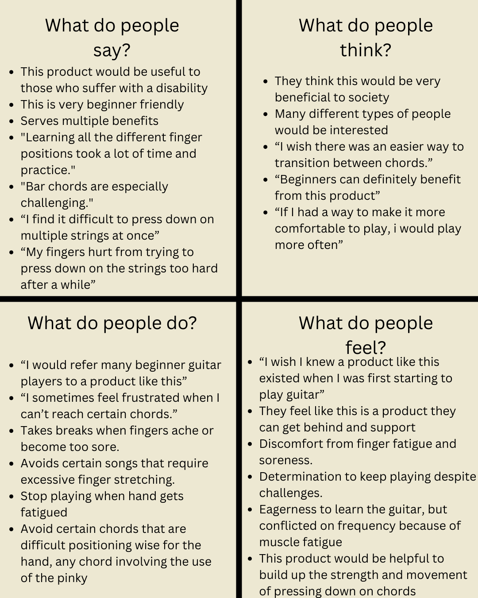
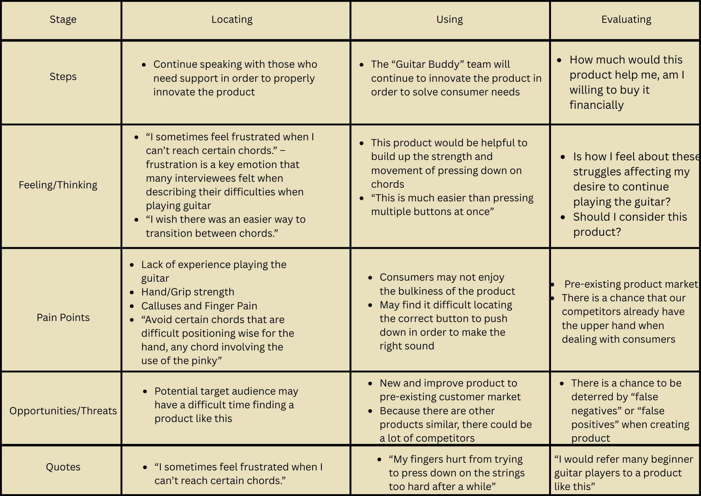
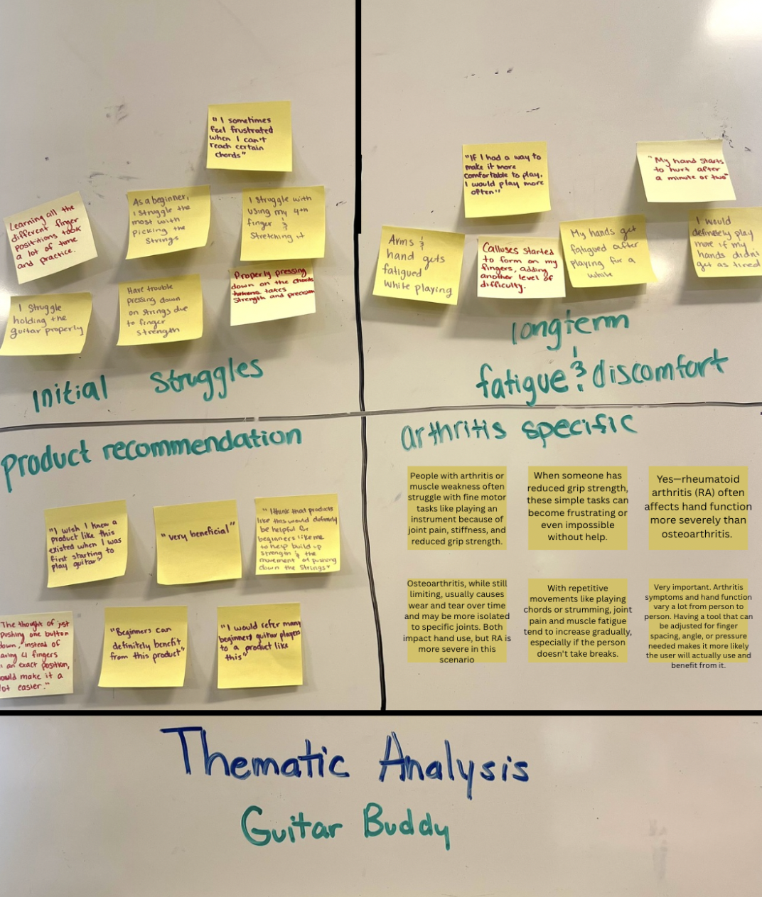
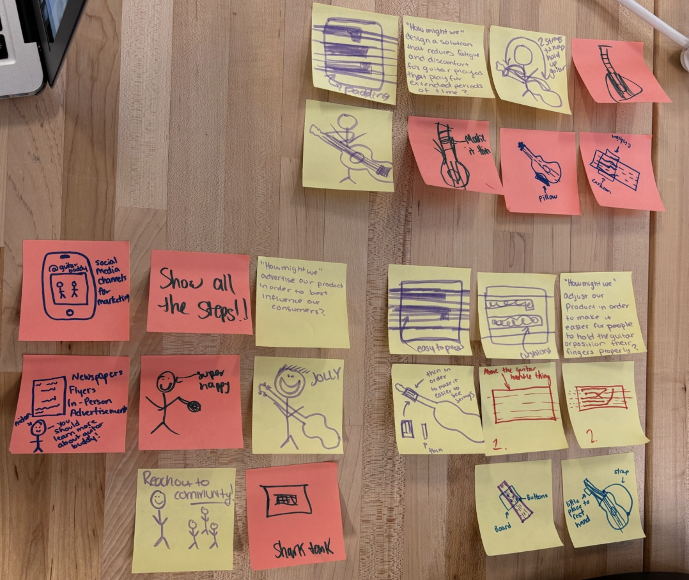
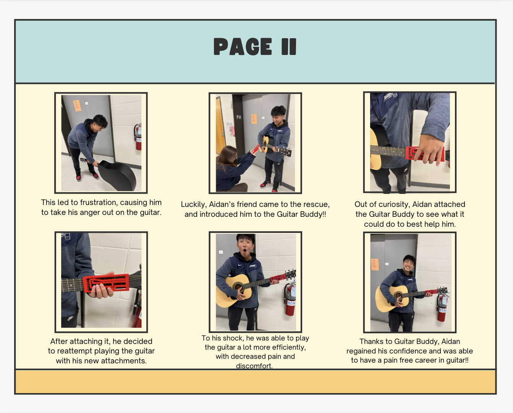
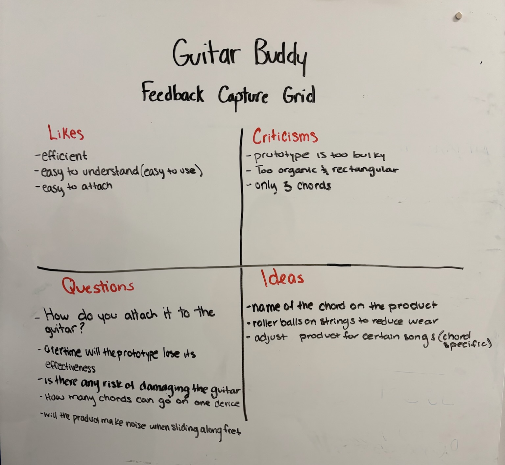
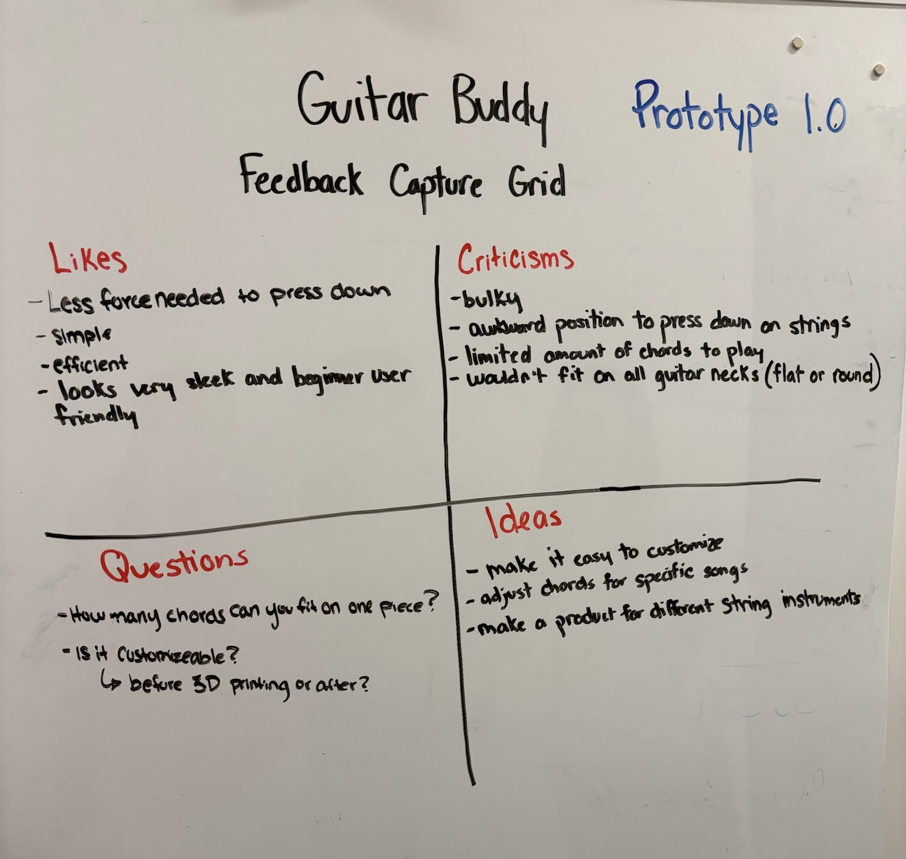
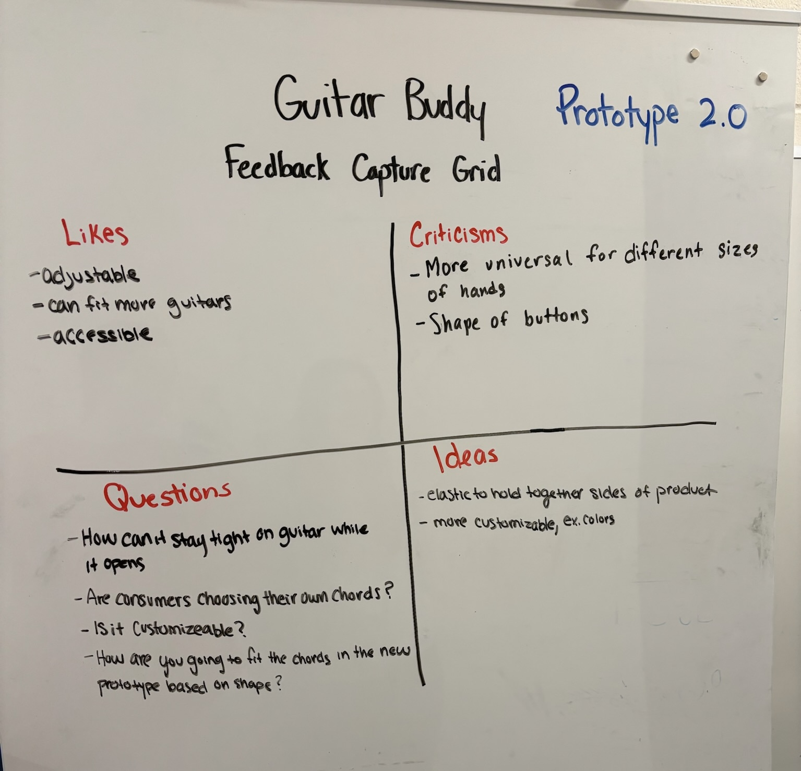

## Introduction

Learning to play the guitar can be a challenging and frustrating experience, especially for beginners and individuals with hand disabilities. To address these challenges, we introduce **Guitar Buddy**—an assistive device designed to make learning the guitar more accessible and enjoyable for everyone.

## Empathy and Journey Maps

Before developing Guitar Buddy, we conducted interviews with four individuals to understand the common challenges faced by guitar learners. This research led to the creation of empathy and journey maps, highlighting key pain points and experiences.

## Problem Definition

Learning to play the guitar is often time-consuming and frustrating for the average person. For individuals with hand disabilities, the physical and mental demands can lead to abandoning the learning process altogether. Guitar Buddy aims to assist both beginner guitar players and those with disabilities by providing a supportive tool to ease the learning process.

## Thematic Analysis

Our interviews revealed several recurring themes:

- **Initial Struggles**: Many beginners struggle with holding the guitar and positioning their fingers on the strings.
- **Long-term Fatigue & Discomfort**: Extended playing periods often lead to discomfort and fatigue.
- **Product Recommendations**: Interviewees expressed interest in a product that could alleviate these challenges.
- **Arthritis Specific**: Individuals with arthritis or muscle weakness experience frustration due to pain while playing.

### Insight and "How Might We?" Statements

Based on our thematic analysis, we developed the following insights and questions:

- **Initial Struggles**: Many beginners struggle with the foundation of holding the guitar and finger positioning.
  - *How might we adjust our product to make it easier for people to hold the guitar or position their fingers properly?*

- **Long-term Fatigue & Discomfort**: Players feel discomfort after playing for extended periods.
  - *How might we design a solution that reduces fatigue and discomfort for guitar players during long sessions?*

- **Product Recommendations**: There is a clear interest in a product that addresses these challenges.
  - *How might we advertise our product to effectively reach and influence our target consumers?*

- **Arthritis Specific**: Individuals with arthritis feel frustrated when experiencing pain while playing.
  - *How might we adjust our product to accommodate and alleviate arthritic problems?*

## Brainstorming

With these insights, we brainstormed potential designs for Guitar Buddy. Each team member contributed ideas, leading to a collaborative and innovative approach.

## Storyline

To visualize the user experience, we created a storyline depicting a beginner guitarist using Guitar Buddy. This narrative helped us understand the practical applications and benefits of our product.

## Pitch Feedback

In our class pitch, we introduced Guitar Buddy—a device aimed at improving accessibility and ease of learning for guitar players with limited hand mobility. Using the “I Like, I Wish, What If” method, we received feedback from peers highlighting the value of making the product more universal across guitar types and ensuring ease of use for beginners.  
**I Like:** How the device empowers users with arthritis or finger mobility challenges.  
**I Wish:** It could fit more guitar models without risk of damage.  
**What If:** There was a modular or adjustable clamp mechanism?

---

## Prototype v1: Initial Design & Testing

The first physical prototype was modeled in Fusion360 and printed using PLA filament on a Prusa Mini+. It demonstrated our concept of assisted fingering through button-press chord activation. However, several usability concerns emerged:

- The snug fit could damage guitar necks.
- The material was too rigid for long-term comfort.
- Buttons lacked visual indicators for beginners.

### In-Class Testing Summary

We conducted our first round of testing in-class, partnering with the Tactile Map team to gather real-time feedback. Testers interacted with our low-fidelity model and provided insight into:

- **Learnability**: Most understood the concept but wanted better visual guides.
- **Efficiency**: The design worked but slowed down multi-chord transitions.
- **Errors**: Some users mounted the prototype incorrectly.
- **Satisfaction**: Overall enthusiasm was high for its accessibility potential.

### Feedback Capture Grid – Prototype v1

We recorded detailed feedback using a capture grid format during this session. This allowed us to categorize insights and criticisms, helping define goals for the next iteration.

---

## Prototype v2: Iteration & Expanded Testing

In response to the issues with Prototype v1, we created a second version of Guitar Buddy in Fusion360. This prototype focused on making the device adjustable to fit various neck widths without damaging the guitar. We also considered replacing PLA with a more forgiving material and began experimenting with button labeling for beginners.

### External Testing & Interviews

We tested Prototype v2 with four target users:

- A beginner guitarist  
- An intermediate guitarist  
- An advanced guitarist  
- An occupational therapist

These testers confirmed that the new version addressed many issues from the first prototype, but additional refinements were still needed. Key takeaways included:

- Need for better visual and tactile indicators  
- Interest in a foldable or compact design for portability  
- Suggestions to improve comfort during extended play

### Feedback Capture Grid – Prototype v2

We again utilized a feedback capture grid to synthesize this round of testing. The second grid reflected more user-specific insights and highlighted new directions for improvement.

---

## Design Review Summary

After reviewing feedback from both prototype iterations, we identified recurring themes:

- Accessibility is not just ergonomic—it must be adaptable.
- Users are concerned about damaging their instruments.
- Visual clarity and comfort are key for beginners.

These insights guided our decision to redefine the problem and refine our goals.

---

## Guiding Principles

1. **Partner Principles**  
   - Respond to users’ desire for comfort, ease of use, and safety.
   - Address needs of individuals with physical limitations, such as arthritis.

2. **Design Principles**  
   - Avoid overly tight components.
   - Maintain simplicity and beginner-friendliness.

3. **Designer Principles**  
   - Embrace iteration and feedback-driven development.
   - Prioritize empathy, adaptability, and function in our work.

4. **Accessibility Principles**  
   - Ensure usability across guitar types.
   - Design with inclusivity as a core value.

---

## Revised “How Might We” Statements

- **Fit Variability**: How might we design a product that fits most guitars and assists with finger placement?
- **Comfort**: How might we create a lightweight and sleek product that supports longer play sessions?
- **Communication**: How might we better showcase our mission to users?
- **Ease of Use for Arthritis**: How might we ensure Guitar Buddy is intuitive for users with arthritis?

---

## Ideation

Building on all testing phases, we brainstormed new ideas to guide Prototype v3:

1. Add **padding** to protect guitar necks  
2. Include **visual indicators** for chord guidance  
3. Engrave **chord letters** onto each button  
4. Switch to a **softer filament** for comfort  
5. Design a **foldable version**  
6. Use **elastic wraps** for universal fitting  
7. Offer **multiple sizes** for different necks  
8. Include a **feedback mechanism** post-sale  
9. Make **song-specific templates** for learners  
10. Develop a **child-friendly model**  
11. Add a **color-coded button system**  

---

## Full Design Review (Written Version)

For a comprehensive summary of our prototyping, testing, and feedback synthesis, view our full design review document below:

<iframe src="https://docs.google.com/document/d/1OlIt-N3SHmk28rxIj6_cAu8pcSXB3PIYDMm0hJg1oBE/preview" width="100%" height="800px" allow="autoplay"></iframe>

## Bibliography

[@Betts2019]

[@ChordBuddySharkTank]

[bibliography]