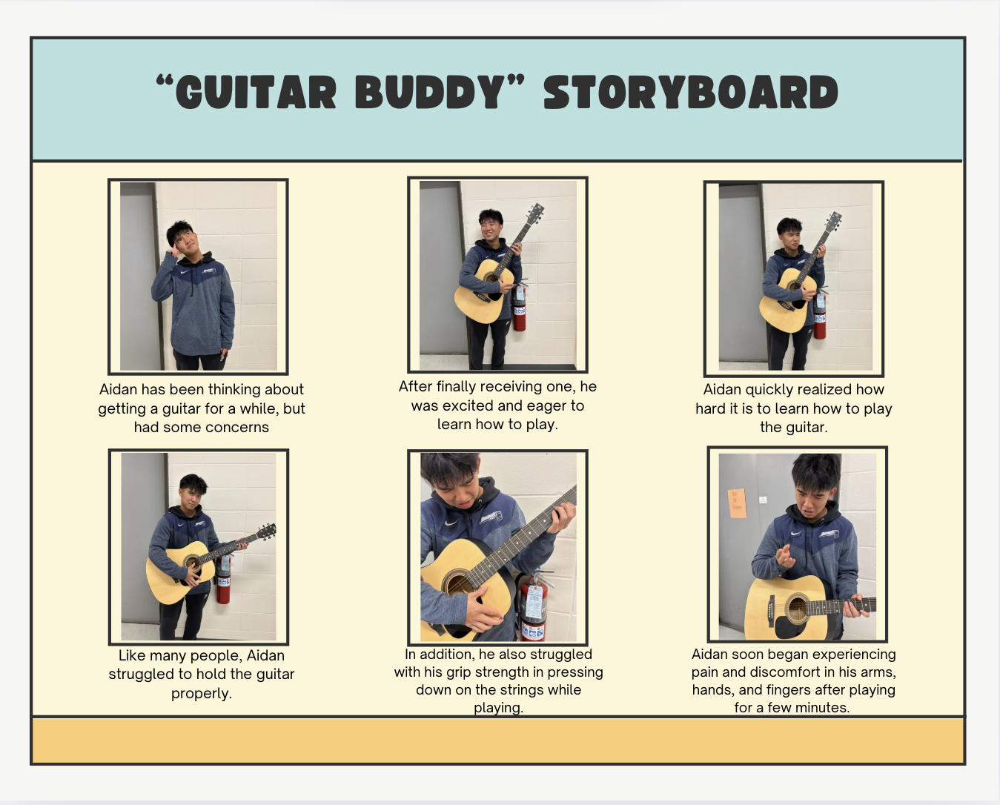

## Introduction

Learning to play the guitar can be a challenging and frustrating experience, especially for beginners and individuals with hand disabilities. To address these challenges, we introduce **Guitar Buddy**—an assistive device designed to make learning the guitar more accessible and enjoyable for everyone.

## 🛠️ Getting Started: How to Use Guitar Buddy

Welcome to the Guitar Buddy open-source guide! This section will help you set up and start using your device.

**Time Required:** ~1 hour  
**Difficulty:** Moderate  
**Tools Required:** 3D printer, elastic bands or Velcro straps or hair ties, super glue  
**Skills Required:** Basic 3D printing and assembly  
**Use Case:** Assistive device for guitar fretting hand  
**Authors:** Sam Kelson, Aidan Wang-Fan, Ava Lorenzana, Rebecca Suarez

---

### Step 1 — Download the STL Files

- **Required parts:** Main Body (with print-in-place joints), Fret Fingers  
- **Optional:** Extra chord overlays/buttons

You can download the necessary STL files below:

- [Main Body STL](/assets/3DFiles/GuitarBuddy/GuitarBuddyMainBody.stl)  
- [Fret Fingers STL](/assets/3DFiles/GuitarBuddy/GuitarBuddyFrets.stl)  
- [D Chord Shape STL](/assets/3DFiles/GuitarBuddy/GuitarBuddyDChordShape.stl)

Here is the full Fusion 360 file for creating custom buttons or chord shapes. To add new overlays:
- Create a new sketch plane on the fretboard
- Project the desired holes
- Connect and extrude upward

- [Full Fusion File](/assets/3DFiles/GuitarBuddy/GuitarBuddy.f3d)

You can also optionally print the **main body and fret fingers combined**:
- [Combined STL](/assets/3DFiles/GuitarBuddy/GuitarBuddyMainBodyAndFretFingersCombined.stl)

> ⚠️ *Note:* While this option saves gluing time, it makes support removal more difficult. If attempting this, use **organic supports** and expect a longer print time.

---

### Step 2 — Prepare Materials and Tools

**Materials**  
- PLA filament for all parts (body, fingers, buttons)  
- Elastic bands, Velcro straps, or hair ties  

**Tools**  
- 3D printer (e.g., Prusa Mini+)  
- Super glue  
- Sandpaper or file (optional for cleanup)

---

### Step 3 — 3D Print All Parts

Load STL files into your slicer with the following settings:

- Layer height: 0.2 mm  
- Infill: 20%  
- Add build plate supports  
- Use PLA for all components

> 🔧 For fret fingers and all chord buttons, ensure the flat face is placed on the print bed.

**Slicer Views:**

  
  

---

### Step 4 — Remove Supports

After printing, carefully remove all support material. The print-in-place joints should begin to move with gentle pressure.

- Get all three pivot points moving—this makes the rest of the support removal easier  
- The joints are durable and can tolerate moderate force

---

### Step 5 — Assemble the Mechanism

Glue the fret finger board to the main body of the tool. Hold down for ~1 minute and then let set for ~10 minutes or until glue is dried.

- Ensure the fingers point **away** from the central pivot  
- The holes on the fret finger board should face **upward**, as shown

**Visual Reference:**

**Assembly Video:**  

<video controls src="/assets/images/guitarBuddy/FretFingerAssembly.mp4" title="Fret Finger Assembly"></video>

---

### Step 6 — Mount to Your Guitar

Mount Guitar Buddy on the neck as follows:

- Use elastic bands, hair ties, or Velcro straps  
- Stretch the elastic over the headstock, then slide the device down into place  
- Align fret fingers just above the strings  
- Ensure both sides of the tool are aligned on the **same fret**

> 🔄 *Tighter bands will reduce slipping but may make repositioning harder*

---

### Step 7 — Play and Customize

- Press buttons to simulate fretting individual strings  
- Use modular chord overlays to play full chords  
- Design custom overlays for different songs or difficulty levels

**Demo Video:**  

<video controls src="/assets/images/guitarBuddy/UsingGuitarBuddy.mp4" title="Using Guitar Buddy"></video>

---

## Empathy and Journey Maps

Before developing Guitar Buddy, we conducted interviews with four individuals to understand the common challenges faced by guitar learners. This research led to the creation of empathy and journey maps, highlighting key pain points and experiences.

## Problem Definition

Learning to play the guitar is often time-consuming and frustrating for the average person. For individuals with hand disabilities, the physical and mental demands can lead to abandoning the learning process altogether. Guitar Buddy aims to assist both beginner guitar players and those with disabilities by providing a supportive tool to ease the learning process.

## Thematic Analysis

Our interviews revealed several recurring themes:

- **Initial Struggles**: Many beginners struggle with holding the guitar and positioning their fingers on the strings.
- **Long-term Fatigue & Discomfort**: Extended playing periods often lead to discomfort and fatigue.
- **Product Recommendations**: Interviewees expressed interest in a product that could alleviate these challenges.
- **Arthritis Specific**: Individuals with arthritis or muscle weakness experience frustration due to pain while playing.

### Insight and "How Might We?" Statements

Based on our thematic analysis, we developed the following insights and questions:

- **Initial Struggles**: Many beginners struggle with the foundation of holding the guitar and finger positioning.
  - *How might we adjust our product to make it easier for people to hold the guitar or position their fingers properly?*

- **Long-term Fatigue & Discomfort**: Players feel discomfort after playing for extended periods.
  - *How might we design a solution that reduces fatigue and discomfort for guitar players during long sessions?*

- **Product Recommendations**: There is a clear interest in a product that addresses these challenges.
  - *How might we advertise our product to effectively reach and influence our target consumers?*

- **Arthritis Specific**: Individuals with arthritis feel frustrated when experiencing pain while playing.
  - *How might we adjust our product to accommodate and alleviate arthritic problems?*

## Brainstorming

With these insights, we brainstormed potential designs for Guitar Buddy. Each team member contributed ideas, leading to a collaborative and innovative approach.

## Storyline

To visualize the user experience, we created a storyline depicting a beginner guitarist using Guitar Buddy. This narrative helped us understand the practical applications and benefits of our product.

## Pitch Feedback

In our class pitch, we introduced Guitar Buddy—a device aimed at improving accessibility and ease of learning for guitar players with limited hand mobility. Using the “I Like, I Wish, What If” method, we received feedback from peers highlighting the value of making the product more universal across guitar types and ensuring ease of use for beginners.  
**I Like:** How the device empowers users with arthritis or finger mobility challenges.  
**I Wish:** It could fit more guitar models without risk of damage.  
**What If:** There was a modular or adjustable clamp mechanism?

---

## Prototype v1: Initial Design & Testing

Our first prototype was not designed from scratch—instead, we began with an existing open-source design found on [Thingiverse](https://www.thingiverse.com/thing:4544167). This initial model served as a foundation for testing the basic mechanics and ergonomics of a guitar fretting aid. Using this pre-existing design allowed us to quickly get feedback on core functionalities and start iterating toward our own customized version. While this first prototype helped validate some of our assumptions, we identified key areas for improvement, particularly in fit, usability, and compatibility across different guitar necks. These insights guided the development of our second, custom-designed prototype.

- The snug fit could damage guitar necks.
- The material was too rigid for long-term comfort.
- Buttons lacked visual indicators for beginners.
- Could not slide tool down guitar neck to get different playing positions.

### In-Class Testing Summary

We conducted our first round of testing in-class, partnering with the Tactile Map team to gather real-time feedback. Testers interacted with our low-fidelity model and provided insight into:

- **Learnability**: Most understood the concept but wanted better visual guides.
- **Efficiency**: The design worked but slowed down multi-chord transitions.
- **Errors**: Some users mounted the prototype incorrectly.
- **Satisfaction**: Overall enthusiasm was high for its accessibility potential.

### Feedback Capture Grid – Prototype v1

We recorded detailed feedback using a capture grid format during this session. This allowed us to categorize insights and criticisms, helping define goals for the next iteration.

---

## Prototype v2: Iteration & Expanded Testing

In response to the issues with Prototype v1, we created a second version of Guitar Buddy in Fusion360. This prototype focused on making the device adjustable to fit various neck widths without damaging the guitar. We also considered replacing PLA with a more forgiving material and began experimenting with button labeling for beginners.

### External Testing & Interviews

We tested Prototype v2 with four target users:

- A beginner guitarist  
- An intermediate guitarist  
- An advanced guitarist  
- An occupational therapist

These testers confirmed that the new version addressed many issues from the first prototype, but additional refinements were still needed. Key takeaways included:

- Need for better visual and tactile indicators  
- Interest in a foldable or compact design for portability  
- Suggestions to improve comfort during extended play

### Feedback Capture Grid – Prototype v2

We again utilized a feedback capture grid to synthesize this round of testing. The second grid reflected more user-specific insights and highlighted new directions for improvement.

---

## Design Review Summary

After reviewing feedback from both prototype iterations, we identified recurring themes:

- Accessibility is not just ergonomic—it must be adaptable.
- Users are concerned about damaging their instruments.
- Visual clarity and comfort are key for beginners.

These insights guided our decision to redefine the problem and refine our goals.

---

## Guiding Principles

1. **Partner Principles**  
   - Respond to users’ desire for comfort, ease of use, and safety.
   - Address needs of individuals with physical limitations, such as arthritis.

2. **Design Principles**  
   - Avoid overly tight components.
   - Maintain simplicity and beginner-friendliness.

3. **Designer Principles**  
   - Embrace iteration and feedback-driven development.
   - Prioritize empathy, adaptability, and function in our work.

4. **Accessibility Principles**  
   - Ensure usability across guitar types.
   - Design with inclusivity as a core value.

---

## Revised “How Might We” Statements

- **Fit Variability**: How might we design a product that fits most guitars and assists with finger placement?
- **Comfort**: How might we create a lightweight and sleek product that supports longer play sessions?
- **Communication**: How might we better showcase our mission to users?
- **Ease of Use for Arthritis**: How might we ensure Guitar Buddy is intuitive for users with arthritis?

---

## Ideation

Building on all testing phases, we brainstormed new ideas to guide Prototype v3:

1. Add **padding** to protect guitar necks  
2. Include **visual indicators** for chord guidance  
3. Engrave **chord letters** onto each button  
4. Switch to a **softer filament** for comfort  
5. Design a **foldable version**  
6. Use **elastic wraps** for universal fitting  
7. Offer **multiple sizes** for different necks  
8. Include a **feedback mechanism** post-sale  
9. Make **song-specific templates** for learners  
10. Develop a **child-friendly model**  
11. Add a **color-coded button system**  

---

## Full Design Review (Written Version)

For a comprehensive summary of our prototyping, testing, and feedback synthesis, view our full design review document below:

<iframe src="https://docs.google.com/document/d/1OlIt-N3SHmk28rxIj6_cAu8pcSXB3PIYDMm0hJg1oBE/preview" width="100%" height="800px" allow="autoplay"></iframe>

## Iteration Log

### Addressing the Guitar Neck Taper

After printing and testing **Prototype 2**, we uncovered a critical mechanical issue: while the central pivot allowed the device to flex around the neck, it wasn’t enough to ensure that the fret overlays aligned properly with the guitar strings.

The issue stemmed from the **tapered shape of the guitar neck** — as the neck widens slightly along its length, our original arm design caused the sides of the device to angle outward, breaking alignment with the frets. This misalignment reduced usability and defeated the purpose of accurate finger placement.

#### ✅ Solution: Side Arm Pivots

We introduced **additional pivots** where the center arms connect to the device's sides. These pivots allow the sides of the device to **remain parallel to the guitar neck**, ensuring accurate fret alignment and improving cross-guitar compatibility. Crucially, it allows the device to slide along the neck of the guitar.

---

### Engineering the Fretboard Mechanism

Next, we focused on designing a **fretboard mechanism** that lets users press buttons ("fret fingers") to simulate finger placement.

Our goals:
- **Flexibility**: Fingers should bend under pressure and snap back into place.
- **Rigidity**: Pressing one finger shouldn't trigger movement in others.

We experimented with **TPU** and **PLA**, iterating through three major designs:

#### ❌ Flat TPU Sheet

- **Pros**: Flexible and easy to print.
- **Cons**: Covered the strings and frets completely, eliminating visual feedback. Button response was inconsistent and too soft.

#### ❌ Three Protrusions,  One for Each String

- **Pros**: Better fret visibility and slightly improved finger action.
- **Cons**: Outer fingers had less torque (closer to pivot), making them hard to press. String alignment was challenging. TPU was too floppy; PLA was too rigid.

#### ✅ Final Design: Single Rigid Arm with Three Fingers

- **Uniform torque** due to equal pivot distances.
- **Simpler alignment** with guitar strings.
- **Material choice**: PLA offered a good compromise. By varying thickness, we could achieve both flexibility and rigidity within the same part.

This design worked best across all metrics — it was **snappy, aligned, and more reliable**.

---

### Adding Modular Chord Buttons

To improve usability and allow users to easily press multiple fret fingers at once, we introduced **modular chord buttons**. These are custom-printed pressable overlays that connect to specific combinations of fret fingers, enabling users to form full chords with a single motion.

We achieved this by adding **holes to the tops of the fret fingers**. This allowed us to design snap-on chord buttons that can selectively press down any combination of fingers.

#### 🔧 How to Design a Chord Button

To create a new chord shape:

1. **Project** the holes of the fret fingers you want to press into a new sketch in Fusion360.
2. In that sketch, **connect the hole locations** using small beams or bridges.
3. **Extrude** a top surface (the button) to your desired height or shape.
4. Print the button and press it into the holes — that’s it!

This modular system makes it easy to prototype different chord layouts, support new users, or even develop **song-specific overlays** for teaching purposes.

---

### Final Fit Tuning

The last stage of our iteration process focused on **precise fitting and tolerances**. Even with a functional prototype, we had to resolve:

- Finger **height and spacing**
- Smooth yet stable **pivot movement**
- Reliable **grip across guitar neck sizes**
- Avoiding **component interference**

This phase required lots of **trial and error** — tweaking CAD parameters by millimeters, adjusting print settings, and repeatedly re-fitting components. Though tedious, these refinements were essential for achieving a design that felt both polished and user-friendly.

---

### Quantitative Failure Testing

To further inform our design decisions and material choices, we conducted **basic force testing** on key components. This gave us quantitative insight into how much stress the device could withstand — and where improvements were needed.

#### Test Setup

Using a force gauge, we applied increasing pressure to specific components until failure occurred. We ran two tests:

| **Test #** | **Test Description**                        | **Force Applied** | **Break Point** |
|------------|---------------------------------------------|-------------------|------------------|
| Test 1     | Force applied on the center pivot           | 63.5 N            | Component snapped at the main arm junction.  |
| Test 2     | Force applied to one of the fingers/pressers | 13.6 N            | Finger arm bent and detached under pressure.  |

#### Observations

- The **center pivot** was robust, suggesting the main body structure could handle user-level stress without failure.
- The **fret fingers**, being thinner and more dynamic, broke at lower force thresholds — which matches our expectations.
- These results validated the use of **PLA** with controlled thickness for fret fingers and informed later **reinforcement and sizing decisions**.

---

## Bibliography

[@Betts2019]

[@ChordBuddySharkTank]

[bibliography]