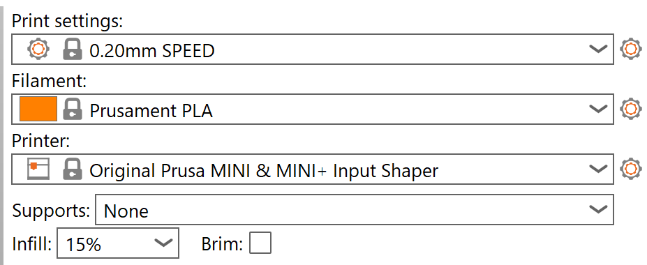

## Introduction

For this project, I explored the fundamentals of electronics prototyping, integrating soldering and component assembly with iterative design processes. Working in a team, we designed and fabricated a custom chassis enclosure for a robotic system, ensuring form, fit, and function through multiple design iterations. Using Autodesk Fusion 360, we developed CAD models and utilized both 3D printing and laser cutting to refine our designs. Key challenges included ensuring accessibility for sensors, wheels, and power components while maintaining the overall fit of the enclosure. This hands-on project strengthened my skills in rapid prototyping, digital fabrication, and collaborative design.

## Robot Assembly

For the first part of this project, my group and I had to assemble our individual D2-5 Intelligent Tracking Car DIY kit robots following [these instructions.](https://m.media-amazon.com/images/I/A1lEYFXJO1L.pdf#page=1&zoom=auto,-83,848) Upon a first read of the instruction manual, I really liked the pictures they added for each step, it might it pretty clear what parts went where. One area that seemed a bit weak was the drive shaft assembly. The working and optimizing the fit of the worm gear is not well described and this would go on to be a problem later.

The first step in this process involved soldering, something I was familiar with but for my teammates was a new skill. However, with my occasional assistance, all of us were able to  solder the electronic components to each of our own boards which we worked on simultaneously. 

The electronic assembly of the cars was pretty straightforward. The main challenge was making sure all components were soldered in the right orientations, mainly the LEDs, capacitors, and transistors. Additionally, some of the soldering iron tips worked better than others and dialing in the correct temperatures was a bit challenging. Finally, the biggest challenge, even for someone experienced with soldering, was making sure to not hold the iron too long on the circuit board. Holding the iron too long on the board can cause the existing solder pads on the PCB to come off of the traces making it impossible for the component to get a good electrical connection. This is a problem I ran into head on. 

When I first put the batteries into my car I noticed immediately one of the lights that reflects into the photoresistor was not working.

After a bit of playing around with a separate battery 'power supply' and multimeter I realized that the one of the capacitors was interrupting the circuit. I elected to remove this capacitor and to replace it. However while doing so I desoldered both pads of the capacitor slot. After doing so I had lost hope in getting the car to work properly. Powering through I was able to look at the circuit diagram and the traces on the PCB and simply completed the circuit with wires, bypassing the capacitor. This worked! I covered the wires in hot glue to prevent any accidental electrical contacts.

The final hurtle to jump was getting the worm gear to drive the wheels properly. This is one area where I believe the instruction manual was lacking. In order for the motors to give the wheels enough torque to move the car the teeth of the worm gear had to mesh well with the teeth of the gear on the axle. This was harder said then done as there was a good amount of play between the various parts that make up the drive train. The most useful tip I found was to tightened down the screws attaching the three way sleeve to the PCB after an initial assembly as much as possible. Also, I feel another pair of gaskets to prevent the gear and axle assembly from moving would be helpful.

Here is a video of the bot moving along a track: 

<video controls src="/assets/images/RobotCarProj/CarMoving.mp4" title="Car on Track" ></video>

## Measurements

For the next part of the project we needed the dimensions of the PCB so we could model it in Fusion and make a chassis enclosure. I used digital calipers to take measurements.

And here are all of them imported into Fusion as parameters.

## Designing on Fusion

Using these parameters along with importing an image of the PCB into Fusion as a canvas I was able to create an initial sketch of the PCB.

Extruding upward, we made our first model which we then preceded to print. 

Using the default settings in Prusa slicer: 

The first iteration of enclosure is shown below: 

## Getting the Fit Right

As you can see the enclosure does not fit around the components on the PCB. This happened because when I extruded the sketch to make the thickness of the box I extruded inwards instead of outwards, making the box too small. Additionally, because of this error, I was unable to test other aspects of the fit including the extrusions to cover the lights and the width to not interfere with the wheel. On our next iteration we changed the extrusion direction and was able to test more aspects of the fit. 

We forgot to take pictures of this second iteration, but we were able to quickly diagnose other issues with the fit. These included interference between the case and the wheels and squeezing around the front headlights and other components on the front of the car.

For the next iteration we added wheel cutouts and a cutout to access the on/off switch. This was done by adding sketches onto the faces of main body and then extruding.

Thus we arrived at our third iteration: 

One problem we continued to have was the fit of the wheels along with the length of the body itself. We did not think enough about where the enclosure would rest on the body and so the resting position of the enclosure changed through our iterations. Furthermore, it was challenging to make the models without having the car and a pair of calipers in front of us as often changes were made after class and then printed when we got to class. This made it challenging to iterate as iteration cycles were fairly long. An additional challenge was taking into account various tolerances of the printer and measurements we may have not thought we needed until later, such as the wheel cutouts. In hindsight, due to our longer iteration cycles, it would have been better to measure twice and print once.

In our next iteration we added cutouts for the lights and extended the cutout for the switch to the back of the enclosure. 

As an aesthetic choice we also pasted [the top section of the Mystery Machine from Scooby-Doo](https://www.thingiverse.com/thing:5397647) on to the top of the car.

In Prusa Slicer we flipped the design on to the roof of the car (something we did for all prints so it would print faster and without the need for supports), added supports on the base plate to account for the angle of the mystery machines roof and printed.

As you can see from the picture the fit is pretty good except that the case is still too long and the front edge does not rest on the PCB as, I realized, is desired.

We did one final iteration with a better fit that I will show later on.

As a quick note, our intended way of accessing the batteries with this enclosure was to simply lift the case off the PCB. All other requirements for movement, LED and switch access were met.

## Reflection on 3D Printing

Overall the process of 3D printing was very smooth and the only main issues were the slow iteration times I mentioned earlier.

## Laser Cutting an Enclosure

In the next part of this project we designed and laser cut a box to fit around the chassis. This was a opportunity to learn the limitations and advantages of another type of manufacturing, laser cutting!

Following the same tutorial as for my [previous project](https://samkelson.github.io/projects/3D_remixing/) on creating a box using dovetails by [Product Design Online](https://productdesignonline.com/fusion-360-tutorials/parametric-dovetail-joints-in-fusion-360-made-easy/) I created a box to surround the car that would rest on top of the PCB. I initially started with the tutorial linked in the instructions but found it to be very inefficient as it did not make use of the patterning system in Fusion. I imported the parameters I used for the 3D print version of the enclosure with a few additions for the dovetails and then went to work.

As I was not sure how well dovetails would work I opted to set the dovetail angle to zero, creating finger joints instead.

After importing into Lightburn and learning how to laser cut and get familiar with safety procedures, I printed our first iteration. 

We accidentally printed in Acrylic which while looking nice was a very hard to assemble and glue. 

After attempting to glue with superglue we switched to hot glue which worked much better. After our first iteration, the fit was a bit tight, mainly around the LEDs, so we recut and things looked much better.

With the help of a classmate we also cut holes in the top of the enclosure to access the batteries and switches.

Here is the final product!

As you can see the fit is perfect!

## Reflection on Laser Cutting

Laser cutting was a fun process to learn and it was amazing at how fast we could iterate from design to design. This made getting a good fit a lot easier. On the other hand, it did require some self assembly which was a bit challenging. Additionally, the design was fairly basic and there is not much room for creativity compared to 3D printing.

## Introduction  

This project introduced the fundamentals of electronics prototyping, integrating soldering, component assembly, and iterative design. Working in a team, we designed and fabricated a custom chassis enclosure for a robotic tracking car, focusing on form, fit, and function through multiple design iterations. Using Autodesk Fusion 360, we developed CAD models and utilized both 3D printing and laser cutting to refine our designs. Key challenges included ensuring accessibility for sensors, wheels, and power components while maintaining the overall fit of the enclosure. This hands-on experience strengthened my skills in rapid prototyping, digital fabrication, and collaborative design.

## Robot Assembly  

For the first stage, my group assembled individual D2-5 Intelligent Tracking Car DIY kit robots following [these instructions](https://m.media-amazon.com/images/I/A1lEYFXJO1L.pdf#page=1&zoom=auto,-83,848). The instruction manual included helpful visuals, making it easier to understand part placement. However, the drive shaft assembly section was unclear, particularly regarding the worm gear's fit, which later became an issue.

The process began with soldering, a skill I was familiar with but was new for some of my teammates. With occasional guidance, everyone successfully soldered their circuit boards.

  

The main challenge in electronic assembly was ensuring all components were correctly oriented, particularly LEDs, capacitors, and transistors. Additionally, some soldering iron tips performed better than others, and setting the correct temperature was tricky. The most critical challenge, even for experienced solderers, was avoiding excessive heat application, which could detach solder pads from the PCB.

When I first powered my car, I noticed that one of the LEDs was not working.

  

Using a multimeter and an external battery, I identified a faulty capacitor disrupting the circuit. While attempting to replace it, I accidentally desoldered both capacitor pads, seemingly ruining the board. However, by analyzing the circuit diagram, I bypassed the capacitor with wires, restoring functionality. To prevent accidental contact, I secured the fix with hot glue.

  

The final challenge was ensuring proper engagement between the worm gear and wheel axle. The instruction manual lacked sufficient guidance on this step. Proper torque transfer required careful alignment, which was complicated by play between drivetrain components. The best solution was to tighten the three-way sleeve screws after initial assembly and it would have been nice to add extra gaskets to reduce unwanted movement.

Here’s a video of the car moving along a track:

<video controls src="/assets/images/RobotCarProj/CarMoving.mp4" title="Car on Track"></video>  

## Measurements  

To design the chassis enclosure, we needed precise PCB measurements, which I took using digital calipers.

  

These measurements were then imported into Fusion 360 as parameters.

  

## Designing in Fusion 360  

Using these parameters and a reference image of the PCB, I created an initial sketch in Fusion 360.

  

After extruding the sketch, we produced our first 3D model.

  

Using default Prusa Slicer settings:  

  

Here’s the first 3D-printed enclosure:

  

## Iterating for Fit  

The first enclosure did not fit correctly due to an extrusion direction error, making it too small. This prevented proper testing of component clearances, including LED covers and wheel gaps. For the next iteration, we corrected the extrusion and made additional adjustments.

Although we didn’t document the second iteration with photos, it helped us identify other fit issues, such as wheel interference and inadequate front light clearance.

For the third iteration, we added wheel cutouts and an accessible power switch slot.

  

Resulting in this improved version:

  

One persistent challenge was determining the enclosure’s resting position relative to the PCB. Because modifications to the design were made outside of class, iteration cycles were long, making adjustments difficult. Additionally, accounting for 3D printer tolerances and unforeseen measurement needs—such as precise wheel clearances—proved challenging. In hindsight, more upfront measurements would have streamlined the process.

In the final iteration, we added cutouts for the LEDs and extended the switch cutout to improve accessibility.

  

For aesthetics, we incorporated [the Mystery Machine design from Scooby-Doo](https://www.thingiverse.com/thing:5397647) onto the top of the car.

  

We flipped the model onto the top in Prusa Slicer for faster and more stable printing (something we did throughout) and added build plate supports.

  

The fit improved, but the enclosure was still slightly too long. One final iteration refined this.

To access the batteries, the enclosure was designed for easy removal. All movement, LED visibility, and switch access requirements were met.

## Reflections on 3D Printing  

Overall, the 3D printing process was smooth. The main drawback was the slow iteration cycle, which made refining the fit challenging.

## Laser Cutting an Enclosure  

For the next phase, we designed a laser-cut enclosure, learning the advantages and constraints of this type of subtractive manufacturing.

Following a [Fusion 360 dovetail box tutorial](https://productdesignonline.com/fusion-360-tutorials/parametric-dovetail-joints-in-fusion-360-made-easy/), I created a box that would rest on the PCB. I found the assignment’s suggested tutorial inefficient and instead used Fusion 360’s patterning system for faster iteration.

  

To simplify assembly, I opted for finger joints instead of dovetails by setting the dovetail angle to zero.

  

After learning Lightburn and laser cutting procedures, we produced our first prototype.

  

We accidentally printed in Acrylic which while looking nice was a very hard to assemble and glue. 

  

Hot glue proved more effective than superglue due to faster drying times as we did not know about the quick drying spray. In the second iteration, we improved fit around the LEDs and refined component access.

With a classmate’s help, we laser-cut access holes for the battery and switch.

  

Final version:

  

## Conclusion  

This project provided valuable hands-on experience with both additive and subtractive manufacturing techniques. Iterating on the chassis enclosure highlighted the importance of precise measurements, tolerances, and planning ahead to minimize iteration time. While 3D printing allowed for intricate custom shapes, laser cutting provided a faster workflow for structural components. Overall, this experience deepened my understanding of design-for-manufacturing principles and collaborative problem-solving in engineering.